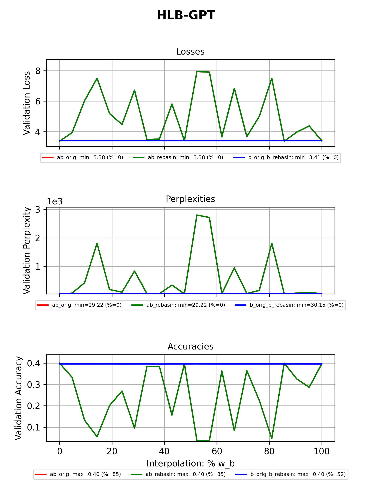
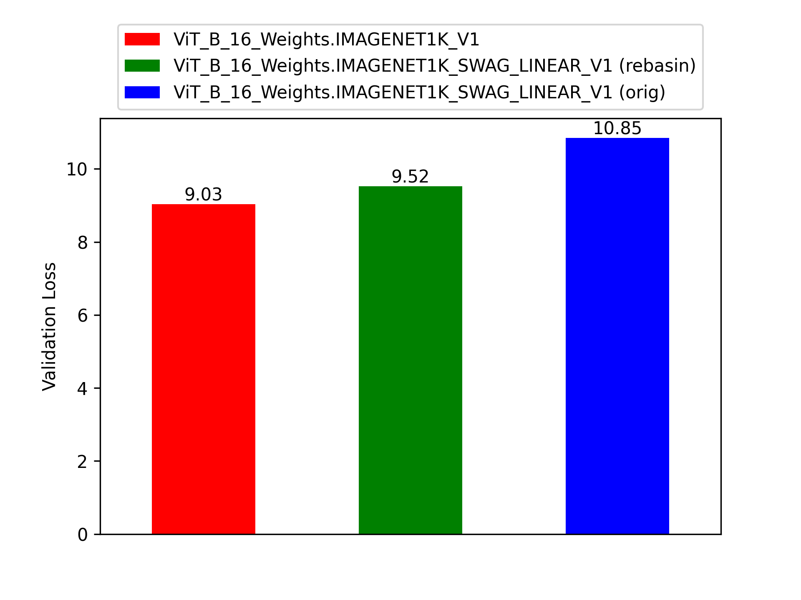
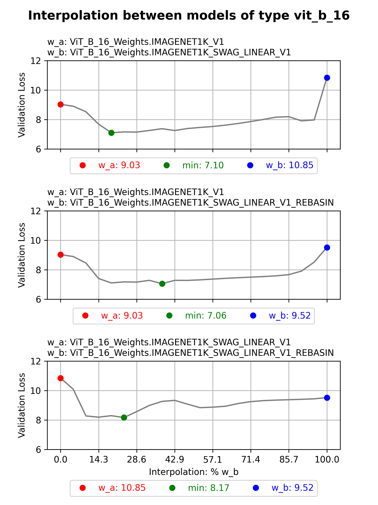
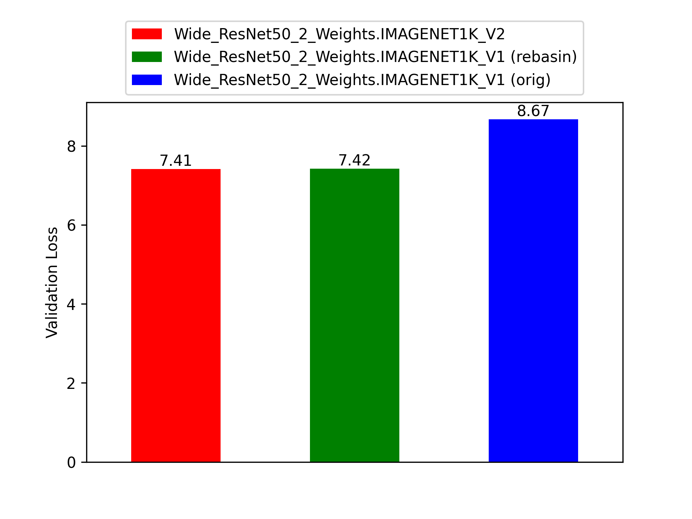
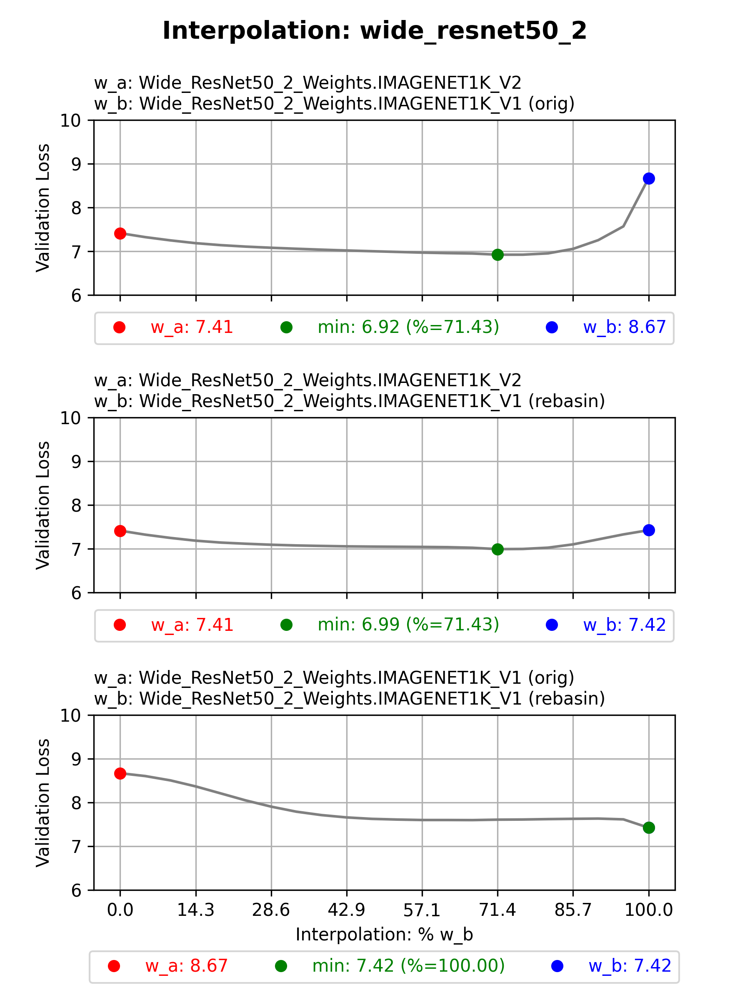
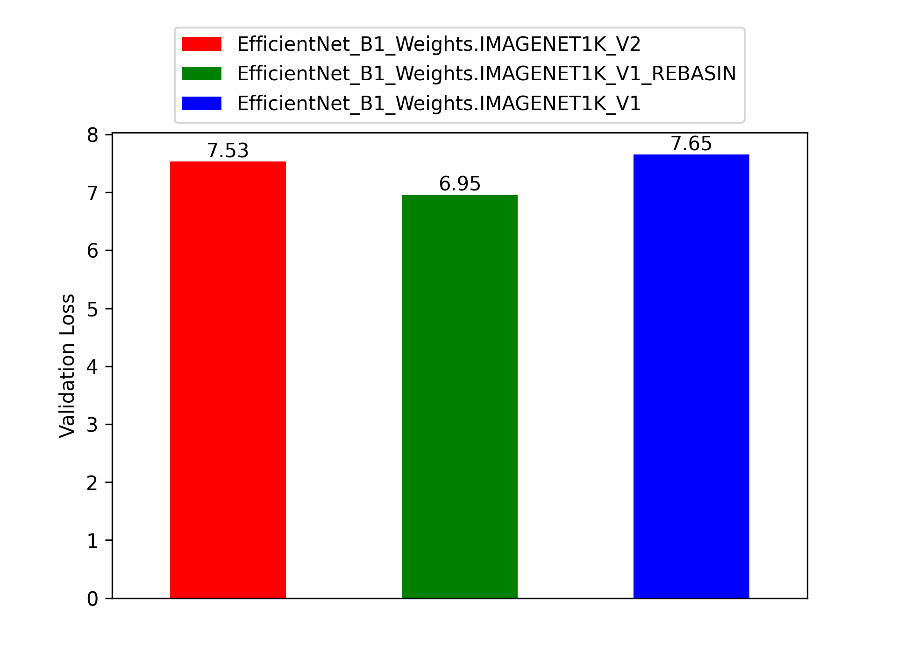
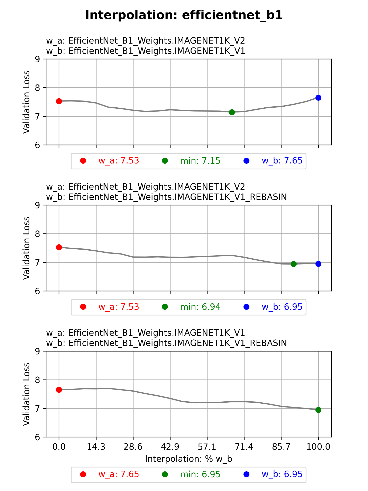

# rebasin


[](https://www.python.org/downloads/release/python-370/)


An implementation of methods described in 
["Git Re-basin"-paper by Ainsworth et al.](https://arxiv.org/abs/2209.04836)

Can be applied to **arbitrary models**, without modification.

**Table of Contents**

- [Installation](#installation)
- [Usage](#usage)
- [Results: Weight-matching (PermutationCoordinateDescent)](#results-weight-matching-permutationcoordinatedescent)
  - [HLB-GPT](#hlb-gpt)
  - [torchvision.models](#torchvisionmodels)
    - [Caveats](#caveats)
    - [General takeaways](#general-takeaways)
    - [vit_b_16](#vitb16)
    - [efficientnet_b1](#efficientnetb1)
- [Plans](#plans)
- [Acknowledgements](#acknowledgements)

## Installation
```bash
pip install rebasin
```

## Usage

Currently, only weight-matching is implemented as a method for rebasing, 
and only a simplified form of linear interpolation is implemented.

```python
import torch
from torch import nn
from rebasin import PermutationCoordinateDescent
from rebasin import interpolation

model_a, model_b, train_dl, val_dl, loss_fn = ...
device = "cuda" if torch.cuda.is_available() else "cpu"


def eval_fn(model: nn.Module, model_device: str | torch.device | None = None) -> float:
    loss = 0.0
    for inputs, logits in val_dl:
        if model_device is not None:
            inputs = inputs.to(model_device)
            logits = logits.to(model_device)
        outputs = model(inputs)
        loss = loss_fn(outputs, logits)
    return loss / len(val_dl)


input_data = next(iter(train_dl))[0]

# Rebasin
pcd = PermutationCoordinateDescent(model_a, model_b, input_data)
pcd.calculate_permutations()
pcd.apply_permutations()

# Interpolate
lerp = interpolation.LerpSimple(
    models=[model_a, model_b],
    devices=[device, device],
    eval_fn=eval_fn,  # Can be any metric as long as the function takes a model and a device
    eval_mode="min",  # "min" or "max"
    train_dataloader=train_dl,  # Used to recalculate BatchNorm statistics; optional
)
lerp.interpolate(steps=10)

# Access model with lowest validation loss:
lerp.best_model
```

## Results: Weight-matching (PermutationCoordinateDescent)

Below, I present some preliminary results. In them, I used `torchvision`-models with two different 
pre-trained weights. I interpolated between the two sets of weights, 
"rebasined" one, and interpolated again, saving all the losses.

---

### HLB-GPT

I forked [tysam-code/hlb-gpt](https://github.com/tysam-code/hlb-gpt) 
(see [here](https://github.com/snimu/hlb-gpt)) and trained two models on the same dataset
(`model_a` and `model_b_original`).
I rebasined `model_b_original` towards `model_a` to get `model_b_rebasin`, 
and interpolated between the resulting models in the following combinations:

- `model_a` and `model_b_original`
- `model_a` and `model_b_rebasin`
- `model_b_original` and `model_b_rebasin`

The results are shown below:

<p align="center">
  
</p>

Two things become obvious:

1. The rebasined model (`model_b_rebasin`) is way worse 
    than the original model (`model_b_original`)
2. Interpolation between any of the three models is anything but smooth.
    However, the interpolated models aren't significantly worse than the original ones;
    in many cases, they have similar performance

Point 2 makes me wonder which is better: training a model for a long time,
or training two models for a short time, rebasining one towards the other,
and retraining it for a short time.

However, in total, this experiment was a failure.

It will be interesting to see whether bigger models will show better results.
According to Ainsworth et al., the method should work better if the filters are bigger.
The `SpeedyLangNet` used here has ~30M parameters; the `vit_b_16` used in the next section
has ~86M parameters.

---

---

### torchvision.models

Below, I discuss results for models from `torchvision.models` 
that have two distinct sets of weights.

I rebasin the worse weights towards the better ones, then interpolate as in [HLB-GPT](#hlb-gpt).

I call the better of the original weights `model_a`, and the worse `model_b_original`.
The rebasined version of `model_b_original` is called `model_b_rebasin`.

---

#### Caveats

**Caveat 1**: I tested on CIFAR10, even though the models are trained on ImageNet.
This is because I don't currently have access to the ImageNet dataset as used 
for training the torchvision models
(the dataset should be [here](https://image-net.org/challenges/LSVRC/2012/), 
but seems unavailable. Please correct me if I'm wrong).
I will try to gain that access and repeat the experiments.
For now, these results have to suffice; I think that they are still interesting.

**Caveat 2**: For many of the models with BatchNorm, I did not recalculate the 
BatchNorm statistics before or after rebasing, even though it is recommended
(and a good idea to do when facing a new dataset). 
I also only used 10% of the evaluation dataset for evaluation.
Both of these things were done to speed up the experiments,
because I cannot afford to rent an A100 for a week.
**Those models are marked with a \*.**

**Caveat 3**: I did not include the results for all models below,
so if you want to see more, look at the files in 
[tests/results/torchvision/cifar10](tests/results/torchvision/cifar10)
and [tests/results/torchvision/cifar10/images](tests/results/torchvision/cifar10/images).

---

#### General takeaways

1. The weights that are better on ImageNet are also better on CIFAR10.
2. The rebasined model performs better than the original model. It would be interesting to see
   whether this is true if the better weights are rebasined towards the worse weights, 
   instead of the other way around.
3. The loss basins of the different models trained on ImageNet seem to 
   roughly surround a single loss basin for CIFAR10.
   - This means that the interpolated models tend to perform better than the original models.
   - The models interpolated between model_a and model_b_rebasin are usually the best.
   - This means that rebasing + interpolating can be a decent preparation for transfer learning, 
     especially as it is very fast.
   - There are no (significant) loss barriers between the original two models, 
     making this test less useful for testing the weight-matching method.
  
---

#### vit_b_16

<details>

<summary>Expand for naming key</summary>

- `model_a`: ViT_B_16_Weights.IMAGENET1K_V1
- `model_b_original`: ViT_B_16_Weights.IMAGENET1K_SWAG_LINEAR_V1 (orig)
- `model_b_rebasin`: ViT_B_16_Weights.IMAGENET1K_SWAG_LINEAR_V1 (rebasin)

</details>

Comparing the losses of the original models and the rebasined model, 
we can see that [takeaways 1 and 2](#general-takeaways) are true:

<p align="center">
  
</p>


When the losses of all models, including the interpolated ones, are drawn as below,
we can see that the plots support [all three takeaways](#general-takeaways):

<p align="center">
  
</p>


It seems that rebasing works very well for this model, which is not surprising.
Ainsworth et al. mention that their method works better if the filters are larger,
and the ViT models have very large filters.

Again, testing on ImageNet is crucial here! I will attempt to do so in the future.

---

#### wide_resnet50_2

<details>

<summary>Expand for naming key</summary>

- `model_a`: Wide_ResNet50_2_Weights.IMAGENET1K_V2
- `model_b_original`: Wide_ResNet50_2_Weights.IMAGENET1K_V1 (orig)
- `model_b_rebasin`: Wide_ResNet50_2_Weights.IMAGENET1K_V1 (rebasin)

</details>

This is a model with `BatchNorm`s in it. In this case, the `BatchNorm` statistics
were recalculated for every single model that was evaluated. For evaluation,
the full evaluation dataset was used.

The results are very similar to those of the other models.

<p align="center">
  
</p>

Interestingly, the best model is found by interpolating between the original models,
instead of `model_a` and `model_b_rebasin`, despite the fact that the latter 
is better than `model_b_original`!

<p align="center">
  
</p>

---

#### efficientnet_b1*

<details>

<summary>Expand for naming key</summary>

- `model_a`: EfficientNet_B1_Weights.IMAGENET1K_V2
- `model_b_original`: EfficientNet_B1_Weights.IMAGENET1K_V1 (orig)
- `model_b_rebasin`: EfficientNet_B1_Weights.IMAGENET1K_V1 (rebasin)

</details>

From both the losses of the original models and the rebasined model,
as well as the losses of the interpolated models, we can see that
[all takeaways](#general-takeaways) are true, except that the 
rebasined model lies very close to the optimum for CIFAR10 
(along the line of interpolation, which still leaves room for improvement):

<p align="center">
  
</p>


<p align="center">
  
</p>

---

## Plans

Here, I present my near-term plans for this package. They may change.

- [x] Implement weight-matching
- [x] Implement linear interpolation
- [x] Test on other datasets with other models &mdash; for example, I would like to test
      `rebasin` on [hlb-gpt](https://github.com/tysam-code/hlb-gpt)
- [ ] Increase unittest-coverage and test on push / merge (GitHub Actions)
- [ ] Test on ImageNet
- [ ] Create proper documentation and write docstrings
- [ ] Implement other rebasing methods:
    1. Straight-through estimator. This allegedly has better results than weight-matching,
       though at higher computational cost.
    2. Activation-matching. Just for completeness.
- [ ] Implement other interpolation methods:
    1. Quadratic interpolation
    2. Cubic interpolation
    3. Spline interpolation
      
    This is especially relevant for interpolating between more than two models at a time.


## Acknowledgements

**The paper:**

```
Ainsworth, Samuel K., Jonathan Hayase, and Siddhartha Srinivasa. 
"Git re-basin: Merging models modulo permutation symmetries." 
arXiv preprint arXiv:2209.04836 (2022).
```

Link: https://arxiv.org/abs/2209.04836 (accessed on April 9th, 2023)


**Other**

My code took inspiration from the following sources:

- https://github.com/themrzmaster/git-re-basin-pytorch
