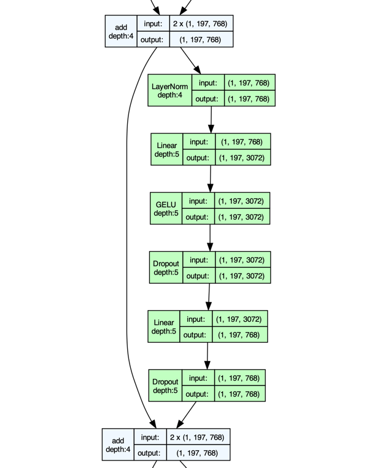

# rebasin


[](https://www.python.org/downloads/release/python-370/)


An implementation of methods described in 
["Git Re-basin"-paper by Ainsworth et al.](https://arxiv.org/abs/2209.04836)

Can be applied to **arbitrary models**, without modification.

---

**Table of Contents**

- [Installation](#installation)
- [Usage](#usage)
- [Limitations](#limitations)
- [Results](#results)
- [Acknowledgements](#acknowledgements)

## Installation
```bash
pip install rebasin
```

## Usage

Currently, only weight-matching is implemented as a method for rebasing, 
and only a simplified form of linear interpolation is implemented.

```python
import torch
from torch import nn
from rebasin import PermutationCoordinateDescent
from rebasin import interpolation

model_a, model_b, train_dl, val_dl, loss_fn = ...
device = "cuda" if torch.cuda.is_available() else "cpu"


def eval_fn(model: nn.Module, model_device: str | torch.device | None = None) -> float:
    loss = 0.0
    for inputs, logits in val_dl:
        if model_device is not None:
            inputs = inputs.to(model_device)
            logits = logits.to(model_device)
        outputs = model(inputs)
        loss = loss_fn(outputs, logits)
    return loss / len(val_dl)


input_data = next(iter(train_dl))[0]

# Rebasin
pcd = PermutationCoordinateDescent(model_a, model_b, input_data)
pcd.calculate_permutations()
pcd.apply_permutations()

# Interpolate
lerp = interpolation.LerpSimple(
    models=[model_a, model_b],
    devices=[device, device],
    eval_fn=eval_fn,  # Can be any metric as long as the function takes a model and a device
    eval_mode="min",  # "min" or "max"
    train_dataloader=train_dl,  # Used to recalculate BatchNorm statistics; optional
)
lerp.interpolate(steps=10)

# Access model with lowest validation loss:
lerp.best_model
```

## Terminology

In this document, I will use the following terminology:

- **To rebasin**: To apply one of the methods described in the paper to a model,
    permuting the rows and columns of its weights (and biases)
- `model_a`: The model that stays unchanged
- `model_b`: The model that is changed by rebasin it towards `model_a`
    - `model_b_orig` for the unchanged, original `model_b`
    - `model_b_rebasin` for the changed, rebasined `model_b`
- **Path**: A linear sequence of modules in a model

## Limitations

### Only some methods are implemented

For rebasin, only weight-matching is implemented via `rebasin.PermutationCoordinateDescent`.

For interpolation, only a simplified method of linear interpolation is implemented 
via `rebasin.interpolation.LerpSimple`.

### Limitations of the `PermutationCoordinateDescent`-class

The `PermutationCoordinateDescent`-class only permutes some Modules:

For one thing, it only permutes the weights of modules with a `weight`-attribute.
This means, for example, that `nn.MultiheadAttention` is currently not supported.
There are plans in place to remedy this, but it will take some time.

There is a second limitation, caused by the requirement to have the permuted model
behave the same as the original model.

`PermutationCoordinateDescent` splits a network into linear paths. 
This means, for example, that a residual block somewhere in the model
splits the network into four paths for the purpose of permutation:

 1. The Path up to the residual path.
 2. The main path in the residual block.
 3. The shortcut path.
 4. The path after the residual block.

For each path, the input-permutation of the first module and the output permutation of
the last module in that path are the identity &mdash; they are not permuted.

This is because **each path needs to permute the weights in it in such a way that the
total permutation of that path is the identity**. In other words, the permuted model 
should not change its behavior due to the permutation.

This property limits the number of modules that are permuted. 

Consider the following example:

<p align="center">
  
</p>

It is a view from the graph of the 
[`vit_b_16`-model](https://pytorch.org/vision/stable/models/generated/torchvision.models.vit_b_16.html#torchvision.models.vit_b_16) 
from `torchvision.models` (see [here](images/vit_b_16.pdf) for the graph of the full model). 

In it, the only Modules with weights are the two `Linear`-layers. 
This means that the only things getting permuted are the output-axis 
of the weight of the first `Linear`-layer and its bias, and the input-axis of the weight of the second
layer.

In other words, if we name these two `Linear`-layers `Linear1` and `Linear2`,
then the rows of `Linear1.weight` (axis 0), the columns of `Linear2.weight` (axis 1), and 
`Linear1.bias` are permuted.

Only permuting so few parts of the model might lead to a poor rebasing, because `model_b` 
may be moved only slightly towards `model_a`. 

As a hint to how much this might be the case,
I applied random permutations to `torchvision.models.vit_b_16` with the weights 
`torchvision.models.ViT_B_16_Weights.IMAGENET1K_V1`. The above constraints were in place.
I then calculated the model change (as defined [here](tests/fixtures/utils.py))
between the original `model_b` and its rebasined version
It is circa **83.8%**. The output between the original model and the rebasined model
only changes by **4.3e-7** (**4.3e-5%**, or **0.000043%**), as measured by 
`(y_orig - y_new).abs().sum() / y_orig.abs().sum()`. 

The output change is very low, as expected.
However, while the model change is fairly high, it might be interesting to 
see if it could be brought higher. 

To remedy this second issue, I plan to give `PermutationCoordinateDescent` the option 
`enforce_identity: bool = True`. If this is set to `False`, then the permutations
will not be constrained to be the identity at the start and end of each path.

It will be interesting to see if this reduces a model's performance, and if so, by how much.

## Results

Currently, only results from the out-of-date, bug-ridden version of rebasin are available.
I've moved them to [results-out-of-date.md](results-out-of-date.md), for the sake of 
completeness. 

Newer results will follow.

## Acknowledgements

**Git Re-Basin:**

```
Ainsworth, Samuel K., Jonathan Hayase, and Siddhartha Srinivasa. 
"Git re-basin: Merging models modulo permutation symmetries." 
arXiv preprint arXiv:2209.04836 (2022).
```

Link: https://arxiv.org/abs/2209.04836 (accessed on April 9th, 2023)


**ImageNet:**

I've used the ImageNet Data from the 2012 ILSVRC competition to evaluate 
the algorithms from rebasin on the `torchvision.models`.

```
Olga Russakovsky*, Jia Deng*, Hao Su, Jonathan Krause, Sanjeev Satheesh, 
Sean Ma, Zhiheng Huang, Andrej Karpathy, Aditya Khosla, Michael Bernstein, 
Alexander C. Berg and Li Fei-Fei. (* = equal contribution) 
ImageNet Large Scale Visual Recognition Challenge. arXiv:1409.0575, 2014
```

[Paper (link)](https://arxiv.org/abs/1409.0575) (Accessed on April 12th, 2023)


**Torchvision models**

For testing, I've used the torchvision models (v.015), of course: 

https://pytorch.org/vision/0.15/models.html

**HLB-GPT**
For testing, I also used [HLB-GPT](https://github.com/tysam-code/hlb-gpt) by @tysam-code: 

    authors:
      - family-names: "Balsam"
        given-names: "Tysam&"
    title: "hlb-gpt"
    version: 0.0.0
    date-released: 2023-03-05
    url: "https://github.com/tysam-code/hlb-gpt"


**Other**

My code took inspiration from the following sources:

- https://github.com/themrzmaster/git-re-basin-pytorch

I used the amazing library `torchview` to visualize the models:

- https://github.com/mert-kurttutan/torchview

